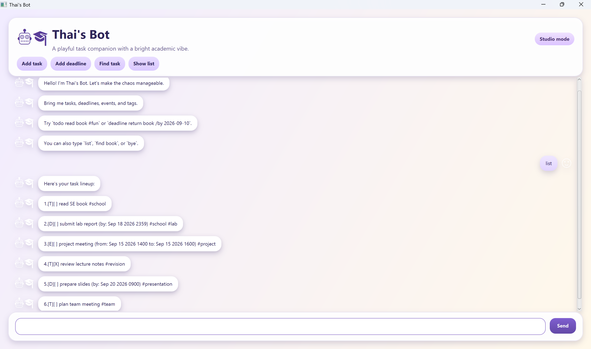

# Thai's Bot



Thai's Bot is a JavaFX desktop chatbot for managing todos, deadlines and events, with tags and date-based search. It was built as the individual project (iP) for NUS CS2103/T.

- **User guide:** https://thainguyen0806.github.io/ip/
- **Download:** the latest `duke.jar` from [Releases](https://github.com/ThaiNguyen0806/ip/releases)

## Running the app

Prerequisite: **Java 25**. On Apple Silicon Macs (M1 or later), use the [Azul Zulu JDK 25 **JDK FX**](https://www.azul.com/downloads/?version=java-25-lts&package=jdk-fx#zulu) package. On Intel Macs, use a standard JDK 25 (e.g., [Temurin](https://adoptium.net/temurin/releases/?version=25)).

Put `duke.jar` in an empty folder, open a terminal in that folder, and run:

```
java -jar duke.jar
```

Tasks are saved to `data/tasks.txt`, relative to the folder the app is run from.

## Setting up for development in IntelliJ

Prerequisites: JDK 25, and the latest version of IntelliJ.

1. Open IntelliJ (if you are not on the welcome screen, click `File` > `Close Project` to close the existing project first).
1. Open the project in IntelliJ as follows:
   1. Click `Open`.
   1. Select the project directory, and click `OK`.
   1. If there are any further prompts, accept the defaults.
1. Configure the project to use **JDK 25** (not other versions) as explained [here](https://www.jetbrains.com/help/idea/sdk.html#set-up-jdk).<br>
   In the same dialog, set the **Project language level** field to the `SDK default` option.
1. Locate the `src/main/java/thaisbot/gui/Launcher.java` file, right-click it, and choose `Run Launcher.main()` (if the code editor shows compile errors, try restarting the IDE). If the setup is correct, a window titled `Thai's Bot` opens.

**Warning:** Keep the `src/main/java` folder as the root folder for Java files (i.e., don't rename those folders or move Java files to a folder outside this path), as this is the default location that some tools (e.g., Gradle) expect to find Java files in.

## Common Gradle tasks

Run these from the project root. On Windows, use `gradlew` (or `.\gradlew` in PowerShell) instead of `./gradlew`.

| Task | Command |
|------|---------|
| Run the GUI | `./gradlew run` |
| Run the tests | `./gradlew test` |
| Check the coding standard | `./gradlew checkstyleMain checkstyleTest` |
| Build the JAR (`build/libs/duke.jar`) | `./gradlew clean shadowJar` |

The JAR includes JavaFX for Windows, Linux and Intel macOS, so one JAR works on all three. On Apple Silicon Macs, the JavaFX included in the Zulu JDK FX is used instead.

## Project structure

```
src/main/java/thaisbot/
├── ThaisBot.java          text-based (console) version of the app
├── Storage.java           loads and saves tasks to data/tasks.txt
├── Ui.java                console output
├── command/               Parser, and one Command class per command
├── gui/                   JavaFX Launcher, app, window and GUI output
└── task/                  Task and its subclasses Todo, Deadline, Event; TaskList
src/main/resources/css/    GUI stylesheet
src/test/java/thaisbot/    JUnit tests
docs/                      user guide (published with GitHub Pages)
```

## Acknowledgements

- Based on the [se-edu Duke project template](https://github.com/se-edu/ip).
- The GUI follows the [se-edu JavaFX tutorial](https://se-education.org/guides/tutorials/javaFx.html).
